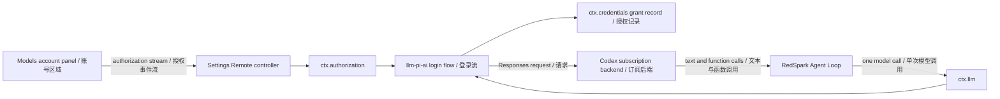

# Agent Note: Codex subscription model bridge

Status: implemented

English | [中文](2026-09-14-codex-subscription-model-bridge.zh.md)

## Problem

The pi-ai adapter already knows how to authenticate `openai-codex` with ChatGPT and send subscription-backed Responses requests, while the authorization seam already owns generic human interaction. The shipped Web composition exposed neither a browser authorization transport nor a visible way to start those flows, so users could not activate that route without custom code.

## Decision

The Web profile mounts `ctx.authorization` and selects only `llm-pi-ai/openai-codex` through the settings controller's `authorizationKeys`. The controller exposes no flows by default and rejects start/cancel requests for unselected keys. This keeps adapter registration separate from product-supported account login. The Models page renders notices and prompts beneath the selected account and preserves the login URL across progress updates. OAuth grants remain Host-only credential records owned by `llm-pi-ai`.

Models settings separates **API models** from **Subscription models**. OpenAI Codex appears only in subscription settings, not API provider rows or add choices. Successful sign-in automatically creates a missing `openai-codex` profile without an API-key reference; reopening settings for a stored account performs the same check. The write uses the observed settings revision, preserves existing profiles, and reports API-key overrides or inactive routes instead of claiming readiness. Failed activation exposes a retry action rather than requiring another login. Users select the model in their conversation; existing session choices do not change. RedSpark owns planning, context, memory, tools, retries, verification, and session persistence. Codex supplies model inference and function-call output only; no Codex Agent Loop runs inside RedSpark. Real-account authorization remains manually unverified.

Browser frames contain progress text, public URLs, device codes, and prompt answers. They never contain stored access or refresh tokens. Closing the initiating stream cancels its live attempt; attempts are process-local and are restarted after a page reload.

Desktop forwards HTTP(S) new-window links from its application page to the system browser while denying the Electron popup. Non-web schemes and embedded URL credentials are rejected. Native-opener failures produce localized advice without exposing the OAuth URL. The browser regression uses the real Host flow and transport, intercepts only the OpenAI page, and verifies opening and cancellation; it does not validate account exchange or subscription inference.

OpenAI documents ChatGPT sign-in as the subscription-access path for Codex clients. It does not document this bridge as a stable third-party API, so compatibility depends on the pinned pi-ai transport and must be revalidated when either that dependency or the backend protocol changes.

## Alternatives considered

**Rust sidecar over Codex source:** a separate bridge duplicates lifecycle, packaging, update, and protocol work while the installed pi-ai dependency already implements the required Codex subscription transport. It remains appropriate only if a later compatibility requirement cannot be met at the adapter seam.

**Codex SDK or app-server integration:** those interfaces run Codex's own agent orchestration and would create two competing loops. They conflict with RedSpark's ownership of every agent step.

**Codex-specific React controls:** the UI renders provider-neutral notices and prompts. The Host configuration owns which account flows are exposed; installing an adapter does not enable its login in the product.

## Consequences

The implementation adds one generic streamed Remote conversation and a small Models-page consumer while leaving `agent-loop` unchanged. Exposing another adapter requires an explicit deployment selection after integration validation. Codex profile activation belongs to the Models-page consumer, not the generic authorization service. A keyless regression assembles the real pi-ai provider with a synthetic account grant, activates its model catalog, and verifies the Codex request URL, account headers, and streamed text while replacing only HTTP fetch. This does not verify live subscription entitlement or billing.
