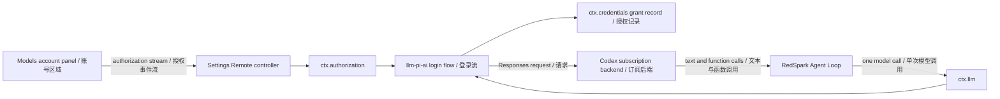

# Agent Note: Codex 订阅模型桥接

Status: implemented

[English](2026-09-14-codex-subscription-model-bridge.md) | 中文

## Problem

pi-ai 适配器已经能够使用 ChatGPT 为 `openai-codex` 鉴权并发送消耗订阅额度的 Responses 请求，授权 seam 也已经持有通用的人机交互。但交付的 Web 组合既没有浏览器授权传输，也没有启动这些流程的可见入口，因此用户仍需编写自定义代码才能激活该路由。

## Decision

Web profile 挂载 `ctx.authorization`，并通过 settings controller 的 `authorizationKeys` 只选择 `llm-pi-ai/openai-codex`。Controller 默认不暴露任何流程，并拒绝未选中 key 的启动请求。发起方 Remote 事件流独占取消权，不向其他浏览器连接暴露按凭据 key 取消的操作。提供方失败只以固定安全文案和白名单授权错误码经过 wire。该机制区分适配器注册与产品支持的账号登录。Models 页面在所选账号下方渲染通知与问题，并在进度更新时保留登录 URL。OAuth grant 与提供方原始错误始终只留在 Host。

模型设置分为 **API 模型**和**订阅模型**。OpenAI Codex 只出现在订阅设置中，不进入 API 提供方列表和添加候选项。登录成功后自动为缺失的 `openai-codex` 提供方创建不含 API-key 引用的 profile；已有账号重新打开设置时自动执行同一检查。写入使用读取到的设置版本，保留已有 profile；存在 API-key 覆盖或未激活路由时会报错，不会宣称模型已就绪。激活失败时提供重试入口，不要求再次登录。用户在会话中选择模型，已有会话选项保持不变。规划、上下文、记忆、工具、重试、验证和 Session 持久化归 RedSpark 所有。Codex 只提供模型推理与 function-call 输出；RedSpark 内不会运行 Codex Agent Loop。真实账号授权仍未经过人工验证。

浏览器帧只包含进度文本、公开 URL、设备码和问题答案，不包含已存储的 access token 或 refresh token。发起方的事件流关闭时会取消实时尝试；尝试只存在于进程内，页面刷新后需要重新开始。

Desktop 将应用页面中的 HTTP(S) 新窗口链接交给系统浏览器，同时拒绝 Electron 弹窗。非网页协议和含内嵌凭据的 URL 被拒绝。原生打开器失败时显示本地化提示，不暴露 OAuth URL。浏览器回归使用真实 Host 流程与传输，只拦截 OpenAI 页面内容，并验证打开与取消；它不验证账号交换或订阅推理。

OpenAI 文档将 ChatGPT 登录说明为 Codex 客户端的订阅访问路径，但没有把本桥接说明为稳定的第三方 API。因此兼容性依赖锁定版本的 pi-ai 传输；pi-ai 依赖或后端协议发生变化时必须重新验证。

## Alternatives considered

**基于 Codex 源码的 Rust sidecar：** 在已安装的 pi-ai 依赖能够提供所需 Codex 订阅传输时，独立桥会重复生命周期、打包、更新和协议工作。只有以后出现无法在适配器 seam 解决的兼容性要求时才应采用。

**Codex SDK 或 app-server 集成：** 这些接口会运行 Codex 自己的 Agent 编排，形成两个竞争的 Loop，不符合每一步均由 RedSpark 决定的所有权要求。

**Codex 专用 React 控件：** UI 渲染与提供方无关的通知与问题，由 Host 配置决定暴露哪些账号流；安装适配器不会自动开放产品中的登录入口。

## Consequences

实现新增一个通用流式 Remote 会话和一个小型 Models 页面消费者，并保持 `agent-loop` 不变。开放其他适配器需要在集成验证后由部署配置显式选择。Codex profile 激活属于 Models 页面消费者，而非通用授权服务。无密钥回归测试使用合成账号 grant 装配真实 pi-ai 提供方，激活模型目录，仅替换 HTTP fetch，并验证 Codex 请求地址、账号请求头和流式文本。这不验证真实订阅资格或计费。
