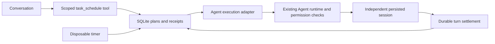

# @deepseek-ai/dsh-task-scheduler

English | [中文](README.zh.md)

## Summary

Create one-shot reminders, recurring tasks, or goal tasks with completion criteria. Plans survive restarts and execution conversations preserve results. Recurring reminders share one conversation; goal tasks continue in their existing conversation. The application must stay running, and delivery is not guaranteed during device sleep.

## Table of Contents

- [Goal tasks](#goal-tasks)
- [Dev Note](#dev-note)
- [Use this package](#use-this-package)
- [Graphical management](#graphical-management)
- [Reminders](#reminders)
- [Schedule window and workspace](#schedule-window-and-workspace)
- [Configuration](#configuration)
- [Architecture](#architecture)
- [Model Experience](#model-experience)
- [Known Limitations and Deferred Work](#known-limitations-and-deferred-work)

## Use this package

Install the plugin into a profile and add [cordis.patch.yml](cordis.patch.yml) to its patches. The Host requires the normal Agent, preset, permission, workspace, and session-persistence services. The database path must be absolute and must identify a dedicated local SQLite file. Do not share it over a network filesystem. Merely importing the package does not enable scheduling; the exported Cordis `apply` mounts it.

From a built source checkout, use `pnpm dsh web --patch apps/cli/config/examples/task-scheduler/cordis.yml`. A Desktop profile can install the built local package through its plugin manager and mount the packaged patch with its own database path; it is not enabled by default.

In a normal conversation, ask the Agent to use `task_schedule` to create a task with a title, prompt, future RFC 3339 `at` timestamp including its UTC offset, and optional `every_seconds`. A recurring schedule uses a fixed elapsed-time interval, not a calendar rule. The workspace, model, Agent preset, and permission preset are captured from the creating session. No API key or access token is copied to the task database. Existing permission and approval checks remain in force for every execution.

The same tool accepts `list`, `pause`, `resume`, `delete`, and `history`. Management is scoped to the exact creating session; forks cannot manage the parent's tasks. Scheduled execution sessions cannot create further schedules. Pause and delete prevent future claims; they do not cancel work already started. A deleted task's retained history is still readable by its owner. A finished one-shot cannot be resumed.

Overdue one-shot tasks run once after startup. Missed recurring periods coalesce to the latest due occurrence and retain the original interval alignment. A task cannot claim another occurrence while it has a running receipt. An expired execution receipt becomes `interrupted` and its task is paused for inspection, because external effects may have occurred. Interrupted occurrences are never automatically replayed. Completion receipts use durable Agent `turn/end` events: `completed` certifies turn completion, not successful code verification. The execution session contains the actual model response and tool results.

## Goal tasks

Goal tasks take an objective and completion criteria, start immediately or once at a future time, and use the existing goals service and goal-round driver in one execution Session. They cannot repeat on a timer. An attempt defaults to ten goal rounds and shares the execution timeout. Only the durable goal phase complete settles a goal successfully, not an ordinary completed reply. The Agent assesses the criteria and records evidence; this is not independent correctness certification. Paused, blocked, timed-out and interrupted attempts retain their Session. Continue task resumes that Session and grants another configured round allowance when exhausted. Restart alone does not replay uncertain work. The preset must include goal tools and the Host must mount the goal-round driver.

## Graphical management

Reminders have a confirmed Delete action. Deletion persists across restarts and hides that occurrence from the inbox, including later outcome updates; it does not suppress desktop completion delivery. The plan and execution receipt remain. Desktop reminders appear together in one window without serial queuing; each expires after 20 seconds, and the window can be closed manually. Past Beijing execution times are rejected; the end must follow the start.

Scheduled-task pause persists the remaining milliseconds until the next occurrence, including across application restarts. Resume waits that remainder; later occurrences follow the same interval from the resumed time. Repeated pause or resume requests do not reset timing. A fixed end time does not move; resuming at or beyond it, or when the remaining wait would reach it, is rejected. Work already running continues. Goal-task pause and continuation use the separate goal lifecycle.

History responses include each reminder's start time resolved from retained task definitions, including deleted plans. The client does not depend on the visible task list. Existing receipts recover their countdown times after deletion or restart; a missing task definition displays an unavailable start instead of substituting the dispatch time.

Run history displays persisted occurrence times in Beijing time with second precision. Direct reminder details show the saved countdown start and actual reminder-generation time as start and end, without delay, duration or explanatory paragraphs. Later recurring occurrences start at the preceding interval boundary; records without countdown information use the recorded execution start. Positive Agent durations below one second display as less than one second; other durations show minutes and remaining seconds. Generation does not certify when a desktop notification became visible. Agent runs retain their scheduled, started and finished times. Equal timestamps remain equal; the UI does not invent elapsed time.

Select **Scheduled task** above New session in the sidebar to open the creation dialog. Session labels use a short title or workspace name. If no eligible session is open, creation connects a blank session in the first registered workspace; if none exists, it asks for a folder. **Settings → Task center** opens all tasks across this authenticated application, including tasks whose owner conversations are closed. The creation dialog and task center share a controller and refresh from the same SQLite authority. Creation immediately refreshes the global list; task changes and history updates synchronize on the next polling cycle (three seconds). The owner picker is shown only while creating. Deleting an execution conversation in the sidebar also hides its run history and reminders. Deleting a finished history record archives its execution conversation before removing the receipt and reminders. Recurring plans remain scheduled. Desktop result windows close automatically 20 seconds after becoming visible, or earlier when dismissed manually. The Upcoming, Paused and Run history cards each open their matching view. Deleted conversations are excluded from the session picker; workspace changes and periodic refresh keep the picker and task views synchronized. Choose a conversation, enter the instructions and completion criteria for a goal, or choose a scheduled task. One-shot tasks have only an execution time; recurring tasks may also have an end time. Time inputs and displays use Beijing time (UTC+8), with seconds. In immediate mode, a leading explicit relative reminder such as 两分钟后 is shown as a delay and calculated by the server at creation using full seconds, without minute rounding. Conversational tools use after_seconds for relative requests. Saving, pausing, resuming, deleting and refreshing use the authenticated `taskScheduler` Remote service without calling a model. The selected conversation supplies the workspace, model and permissions. Application management endpoints operate on global task IDs; the Agent management tool retains its owner-scoped boundary. Deletion requires inline confirmation; refresh retrieves current run results.

The client registers a `settings.section` slot through its own child injection scope after mounting its generated Remote contribution. `gateway.ts` enforces owner boundaries; `management.ts` shares creation policy with tools; the private controller serializes actions and ignores late responses after disposal. Existing UI shell and AgentLoop code are unchanged.

## Reminders

System completion banners show the task name and an explicit **Completed** status in both the title and body; failed, blocked and interrupted outcomes retain their actual status. Clicking the banner opens the reminder inbox and its execution link. Windows controls banner placement, focus-mode suppression and sound. “Completed” describes the Agent run ending, not code-test verification.

The sidebar opens task creation; reminder delivery continues independently in the background. While the client is connected, the plugin polls the authenticated application inbox every three seconds independently of Settings and open conversations. A due plan opens an in-app reminder even while execution is queued containing the task instructions; settlement updates that same reminder to its actual outcome, preserving the instructions, target time and acknowledgement; an execution link becomes available when recorded. Closing the dialog does not mark notices read. **Mark read** persists acknowledgement in SQLite schema version 2; the additive migration preserves version 1 plans and receipts. Unread retained notices reappear after restarting the client, while dismissed notices do not repeatedly reopen within one mount. Completing a read reminder updates its card without resetting acknowledgement or reopening the dialog; its native result banner is still delivered. The inbox retains the newest 100 notices derived from retained receipts. A due notice certifies that the saved target has arrived, not execution admission or completion; native delivery is not an execution prerequisite.

**Enable system notifications** requests permission from a user gesture. When permitted, settled outcomes use the browser/Electron notification API once per observed outcome transition; due reminders stay in-app; clicking one focuses the application and opens the inbox. Denial or native delivery failure does not suppress the in-app reminder. OS focus modes can suppress banners or sound. There is no background OS service, wakeup or guarantee while the application is closed or the device sleeps. The inbox is application-scoped behind the existing Remote authentication boundary, not a multi-tenant per-user inbox.

## Schedule window and workspace

The settings workspace separates **New task**, **Tasks** and **Run history**, with owner-scoped counters. Creation groups task information and timing, groups start and end fields in the timing section, and previews the saved window. An optional **No end time** choice preserves unbounded schedules. Start/end inputs use Beijing time (UTC+8) and are persisted as RFC 3339 instants. `endAt` (tool parameter `end_at`) must be strictly later than `at`; it is an exclusive admission cutoff. No run starts at or after the cutoff, including restart catch-up and queued plans. Already admitted work continues under its ordinary execution timeout. When no further occurrence fits, `nextAt` becomes null. A recurring plan remains active until its end time, even after its last reminder. The UI omits the next-time field when none remains and never substitutes the first occurrence time. Legacy plans without an end remain unbounded. Task cards show planned start/end; history shows actual run start/finish and keeps unfinished runs explicit. Saving successfully switches to the task list.

## Configuration

| Field | Default | Meaning |
| --- | --- | --- |
| `path` | required | Dedicated absolute SQLite path |
| `pollMs` | 250 | Due-time polling interval, 100–60000 ms |
| `runTimeoutMs` | 600000 | Per-run deadline, 1000–86400000 ms |
| `maxConcurrent` | 1 | Maximum running claims, 1–16 |
| `historyLimit` | 50 | Retained finished receipts per task and maximum history response, 1–1000 |
| `minEverySeconds` | 300 | Minimum accepted recurring interval, 60–86400 seconds |

All numeric options require integers. Unloading removes management tools, stops polling, cancels owned executions, drains their disposal, and closes the database without deleting plans.

## Architecture

`store.ts` owns validation and transactional claims; `engine.ts` owns polling and cancellation; `execute.ts` is the runtime adapter; `tools.ts` registers scoped management; `index.ts` owns plugin composition. None modifies AgentLoop. SQLite is the task-plan authority; the session log is the authority for the execution transcript. Neither copies the other's full state. No invariant companion is published: cross-process claims are serialized in the owning database transaction and lifecycle ownership is tested directly.

## Model Experience

### Task management and execution

#### What the model sees

One scoped `task_schedule` management tool and JSON text results, plus the scheduled prompt in each execution session. Tool descriptions are snapshot-tested through a real Loader composition. Status does not claim that generated code is correct.

#### Token effect

The tool schema adds a fixed prompt cost. Listing and history add data-dependent output. Agent work consumes the configured provider's normal allowance; personal reminders do not invoke a model.

#### KV Cache effect

The management schema stays stable while configuration is unchanged. Separate execution sessions do not reuse the creating conversation's history; provider-side reuse is not guaranteed.

## Known Limitations and Deferred Work

- No OS wakeup, execution while the application is closed, calendar cron, or external messaging integrations.
- A process crash between claim and model submission can leave an occurrence unexecuted. It is deliberately not replayed, avoiding duplicate external actions. Inspect an interrupted run before creating a replacement.
- Retention bounds run receipts, not execution sessions or total task count. Normal session management owns transcript deletion.
- Preset identifiers refer to current definitions at execution time. Removing a provider, workspace, or preset can make a saved task fail. Credentials stay in the ordinary provider service.

The [decision record](../../../.agents/notes/implemented/feature/2026-09-15-agent-task-scheduler.md) records lifecycle and persistence tradeoffs.

Run history exposes details, execution-conversation navigation, and confirmed record deletion. Deleting a finished record archives its execution conversation and removes its reminder. Archiving an execution conversation hides its history and reminders. Recurring plans remain until explicitly deleted. Background reminder polling refreshes newly created execution conversations even while Settings is closed.

Recurring reminders start counting at creation and first fire after one complete interval. Further occurrences use a fixed time grid and never start at the exclusive cutoff. Explicit personal reminders persist directly without queueing model work; goals and other work use the Agent. The default Host poll is 250 milliseconds and the client reminder poll is 500 milliseconds. Sleep, closure and event-loop blocking can delay delivery. Recovery coalesces missed occurrences and records actual dispatch times. Reminder cards omit the next execution time and use Beijing dates with colon-separated clocks.

The inbox shows one card per recurring plan with its latest reminder and retained occurrence count. Each occurrence keeps its receipt and acknowledgement state. New occurrences still notify; after restart only the latest occurrence per plan is displayed. Personal reminders do not invoke a model.

Recurring personal reminders append their records to one persisted conversation. A separate journal writer publishes after dispatch without taking a model execution slot. Receipt-derived message identities prevent duplicate replay. Retained receipts share the same conversation link. Deleting that conversation prevents automatic restoration.

Task descriptions can specify relative waits, Beijing clocks, repeat intervals, durations and manual stopping. Timing controls are folded under Adjust time. Explicit description rules must agree with manual settings. Missing timing does not imply immediate execution. Interval-only recurring tasks count from successful creation, have no start-time field, and first execute after one full interval.

Natural-language timing accepts Chinese numeric and written durations, compound waits, Beijing dates and clocks, half-hours and quarter-hours, weekdays, daily or weekly clocks, and explicit clock cutoffs. Undated one-shot clocks mean today and never roll forward when expired. Daily and weekly clocks select their next occurrence and persist fixed UTC+8 intervals. Quoted text is excluded from timing recognition. Multiple clocks, unsupported calendar rules (monthly, yearly, workdays, holidays), and count-based endings require clarification instead of approximation. Reminder intent is separate from work such as checking code before reporting results.

### Dev Note

None.
