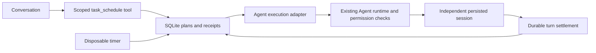

# @deepseek-ai/dsh-task-scheduler

[English](README.md) | 中文

## 概述

创建定时提醒、周期任务或按完成标准推进的目标任务。计划在重启后保留，执行结果保存在会话中。周期提醒共用一个会话；目标任务在同一会话继续。应用必须保持运行，系统休眠时不保证提醒送达。

## 目录

- [目标任务](#goal-tasks)
- [开发备注](#dev-note)
- [使用本包](#use-this-package)
- [图形管理](#graphical-management)
- [主动提醒](#reminders)
- [时间窗口与管理界面](#schedule-window-and-workspace)
- [配置](#configuration)
- [架构](#architecture)
- [模型体验](#model-experience)
- [已知限制与延期工作](#known-limitations-and-deferred-work)

## 使用本包

将插件安装到配置中，并添加 [cordis.patch.yml](cordis.patch.yml)。宿主需要正常的 Agent、预设、权限、工作区和会话持久化服务。数据库必须使用绝对路径和独立的本地 SQLite 文件，不要放在网络文件系统。仅导入包不会启用调度，Cordis 的 `apply` 负责加载。

源码完成构建后，可运行 `pnpm dsh web --patch apps/cli/config/examples/task-scheduler/cordis.yml`。桌面配置可通过插件管理器安装构建后的本地包，再加载包内补丁并指定自己的数据库路径；默认不启用。

在普通对话中让 Agent 使用 `task_schedule` 创建任务，提供标题、任务内容、带 UTC 偏移量的未来 RFC 3339 时间 `at`，以及可选的周期秒数 `every_seconds`。周期按照固定经过时间计算，不是日历规则。创建时保存当前工作区、模型、Agent 预设和权限预设，不复制 API 密钥或访问令牌。每次执行仍遵守原有权限及审批机制。

同一工具支持 `list`、`pause`、`resume`、`delete`、`history`。管理范围限于创建任务的会话，分支会话不能管理父会话的任务。定时执行会话不能再创建定时任务。暂停和删除阻止后续启动，不取消已开始的运行。删除后的保留历史仍可由原会话查看。已结束的单次任务不能恢复。

过期单次任务在启动后执行一次。错过多个周期时只执行最近一次到期任务，并保持原周期基准。同一任务存在运行记录时不能启动下一次。执行记录超过截止时间后标为 `interrupted`，任务暂停等待检查，因为可能已经产生外部影响。中断的这一次不会自动重放。完成记录依据持久化的 Agent `turn/end` 事件；`completed` 只表示 Agent 轮次完成，不代表代码验证通过。具体回复和工具结果保存在执行会话中。

## 目标任务

目标任务填写目标和完成标准，可立即或在指定时间启动一次，使用已有目标服务与目标轮次驱动器，在同一执行会话持续推进，不允许设置周期。每次尝试默认最多十轮，并遵守执行时限。只有持久化目标状态 complete 才算目标完成，普通回复结束不算完成。Agent 按标准判断并保存证据，这不构成独立正确性认证。暂停、阻塞、超时和中断保留原会话；点击“继续任务”恢复该会话，轮次耗尽时允许再执行配置的轮次数。程序重启不自动重放结果不确定的工作。预设必须包含目标工具，Host 必须启用目标轮次驱动器。

## 图形管理

提醒提供带确认的删除操作。删除状态在重启后保留，该次提醒及其后续状态更新不再显示在列表中，但不影响桌面完成通知；计划和执行记录仍保留。多条桌面提醒在同一窗口即时显示，不串行排队；每条显示20秒后独立消失，也可手动关闭窗口。早于当前北京时间的执行时间被拒绝，结束时间须晚于开始时间。

暂停定时任务会持久保存距离下次执行的剩余毫秒数，重启应用后仍保留。恢复后等待这段剩余时间，再以恢复后的执行时间为基准按原间隔继续。重复暂停或恢复不会重置计时。明确设置的结束时间不顺延；恢复时已到期，或剩余等待会达到结束时间，均拒绝恢复。已经开始的定时执行继续运行。目标任务使用独立的目标暂停与继续逻辑。

历史响应包含从保留的任务定义中解析的提醒开始时间，包括已删除计划。客户端不依赖可见任务列表。已有记录在删除任务或重启后仍能恢复计时开始时间；缺少任务定义时显示开始时间不可用，不以发出提醒的时间代替。

执行历史按北京时间显示已保存的本次记录，精确到秒。直接提醒详情以保存的开始计时时间和实际生成提醒时间作为开始、结束时间，不显示延迟、耗时及说明段落。后续周期从上一个间隔边界开始；没有计时信息的记录使用实际执行开始时间。Agent 大于零但不足一秒的耗时显示为“不足 1 秒”，其他耗时按整秒显示。生成时间不代表桌面通知实际可见的时间。Agent 执行仍显示计划、开始和完成时间。相同的时间戳保持相同，界面不虚构耗时。

点击侧栏“新会话”上方的 **定时任务**，直接打开创建窗口。会话显示简短标题或工作区名称。没有可用会话时，创建流程在第一个已登记工作区连接空白会话；没有工作区时，请用户选择文件夹。**设置 → 任务中心** 默认显示当前已认证应用的全部任务，包括所属会话已关闭的任务。创建窗口和任务中心共用控制器与 SQLite 数据源；创建后立即刷新全局列表，任务变更和执行历史在下一次轮询时同步（三秒）。仅创建时显示关联会话选择器。侧栏删除执行会话后，其执行历史与提醒同步隐藏。删除已结束的执行记录时，先归档对应执行会话，再清理记录与提醒；周期计划仍保留。桌面结果小窗显示满 20 秒自动关闭，也可手动提前关闭。顶部“待执行”“已暂停”“执行历史”均可点击进入对应视图。会话选择器排除已删除会话，通过工作区变更订阅与定期刷新同步会话和任务状态。选择已打开的会话，为目标任务填写内容和完成标准，或选择定时任务。单次任务只设置执行时间，周期任务还可设置结束时间。时间输入和显示固定为北京时间（UTC+8），精确到秒。立即启动模式下，任务内容以“两分钟后”等明确相对时间开头时，界面显示识别出的延时，由服务端在创建时按完整秒数计算，不按分钟取整。工具相对时间使用 after_seconds。保存、暂停、恢复、删除和刷新通过已认证的 `taskScheduler` Remote 服务完成，不调用模型。工作区、模型与权限来自选中的会话。应用管理接口按全局任务 ID 操作，Agent 管理工具仍保留所属会话隔离。删除需要在页面内确认；点击刷新获取最新运行结果。

客户端先挂载生成的 Remote 贡献，再通过独立的子注入作用域注册 `settings.section` 插槽。`gateway.ts` 校验会话归属；`management.ts` 与工具共用创建规则；私有控制器串行处理操作，卸载后忽略迟到响应。没有修改已有界面外壳或 AgentLoop。

## 主动提醒

任务完成的系统小窗在标题及正文显示任务名称和明确的 **已完成** 状态；失败、需处理和中断保持其实际状态。点击小窗打开提醒列表及执行结果入口。Windows 决定小窗位置、专注模式屏蔽和声音。“已完成”表示 Agent 本轮运行结束，不代表代码测试通过。

侧边栏入口用于创建任务，提醒投递继续独立在后台运行。客户端连接期间，插件每三秒读取已认证的应用提醒列表，不依赖设置页或所属会话是否打开。任务到期即弹出应用内提醒，即使执行仍在排队，展示任务内容；执行结算在同一张提醒卡上更新实际状态，保留任务内容、目标时间和已读标记，有执行会话时可直接跳转。关闭弹窗不会标为已读。**我知道了** 将确认状态保存到 SQLite 第二版结构；增量迁移保留第一版计划和运行记录。重启后保留的未读提醒会重新提示，同一次加载中已关闭的提醒不会重复弹出。已读提醒执行结束后原位更新，不重置已读或重新打开弹窗，但仍发送系统结果通知。列表展示保留运行记录产生的最新 100 条提醒。到点提醒证明计划时间已到，不代表已开始或完成执行；系统通知投递不是执行前提。

**开启系统通知** 通过用户点击申请权限。获准后，执行结果使用浏览器/Electron 通知 API，每次观察到结果变化通知一次；到点提示保留在应用内；点击系统通知会聚焦应用并打开提醒列表。权限被拒或系统通知投递失败不会阻止应用内提醒。系统专注模式可能屏蔽横幅或声音。没有操作系统后台服务和唤醒能力，应用关闭或设备休眠时不能保证提醒。提醒列表沿用 Remote 认证边界，范围为当前应用，不是多租户的分用户收件箱。

## 时间窗口与管理界面

设置页分为 **新建任务、任务列表、运行记录**，顶部展示所属会话的任务概览。创建流程分为任务信息与时间安排。单次任务可设置执行时间；周期任务从创建成功时开始计时，不提供单独的起始时间，只显示间隔与结束条件。可选 **不设结束时间** 保留无限期计划。输入采用北京时间，以 RFC 3339 时刻保存。`endAt`（工具参数 `end_at`）必须严格晚于 `at`，作为不包含该时刻的启动截止点。到达截止点后不再启动任务，包括重启补执行与排队任务；已调度的执行继续遵守原有超时限制。没有后续可执行时刻时 `nextAt` 变为 null；周期仍保持进行中，直到总结束时间。没有下次时间时省略该字段，不回退显示首次执行时间。没有结束时间的旧计划保持原行为。任务卡显示计划起止时间，运行记录显示实际开始与结束，未结束明确标记。保存成功后切换到任务列表。

## 配置

| 字段 | 默认值 | 含义 |
| --- | --- | --- |
| `path` | 必填 | 独立 SQLite 文件的绝对路径 |
| `pollMs` | 250 | 到期检查间隔，100–60000 毫秒 |
| `runTimeoutMs` | 600000 | 单次截止时间，1000–86400000 毫秒 |
| `maxConcurrent` | 1 | 最多同时运行的认领数，1–16 |
| `historyLimit` | 50 | 每任务保留的结束记录数及历史响应上限，1–1000 |
| `minEverySeconds` | 300 | 最短可接受周期，60–86400 秒 |

所有数字选项必须为整数。卸载时移除管理工具、停止轮询、取消插件拥有的执行、等待清理并关闭数据库，不删除计划。

## 架构

`store.ts` 负责校验和事务认领；`engine.ts` 负责轮询与取消；`execute.ts` 对接 Agent；`tools.ts` 注册会话范围的管理工具；`index.ts` 负责插件组合。不修改 AgentLoop。SQLite 管理任务计划，会话日志管理执行过程，两者不复制对方的完整状态。不发布 invariant 配套模块：跨进程认领在所属数据库事务中串行化，生命周期通过测试直接验证。

## 模型体验

### 任务管理与执行

#### 模型看到什么

一个会话范围的 `task_schedule` 管理工具、JSON 文本结果，以及执行会话中的定时任务内容。工具描述通过真实 Loader 组合快照测试。状态不声称生成代码正确。

#### Token 影响

工具 schema 增加固定提示词成本，列表与历史增加随数据变化的输出。Agent 执行消耗所配置提供方的正常额度；个人提醒不调用模型。

#### KV Cache 影响

配置不变时管理工具 schema 稳定。独立执行会话不复用创建对话的历史，不保证提供方缓存复用。

## 已知限制与延期工作

- 不提供系统唤醒、应用关闭期间执行、日历 cron 或外部消息平台集成。
- 认领后、提交模型前崩溃可能使该次未执行。为了避免重复外部操作，有意不重放；补建任务前请检查中断记录。
- 保留数量限制针对运行记录，不限制执行会话或任务总数。会话管理负责删除执行过程。
- 预设标识在执行时指向当前定义。删除提供方、工作区或预设可能使已有任务失败。凭证仍归普通提供方服务管理。

[决策记录](../../../.agents/notes/implemented/feature/2026-09-15-agent-task-scheduler.zh.md)说明生命周期和持久化的取舍。

运行记录提供展开详情、查看执行会话和确认删除按钮。删除已结束记录时会归档对应执行会话并移除提醒；删除执行会话时会同步隐藏对应历史和提醒。周期计划保留到用户明确删除。后台提醒轮询会刷新新建的执行会话，关闭设置时也会同步到左侧列表。

周期提醒以创建时刻（或用户选择的开始时刻）为计时起点，首次在一个完整间隔后触发，再按固定时间网格运行，结束时间为不再触发的边界。明确以“提醒我”表达的个人提醒直接生成持久化提醒记录，不排队调用模型；目标任务和其他工作仍通过 Agent 执行。后台默认每 250 毫秒检查，前台每 500 毫秒读取提醒；系统休眠、应用关闭及事件循环阻塞仍可能导致延迟。恢复时合并过期节点，记录真实触发时间，不伪造准点历史。提醒卡片不显示当前计划的下一次执行时间，统一使用北京时间的日期及冒号时间格式。

同一周期计划在提醒面板只显示一张卡片，更新最近提醒时间与保留的记录数。每轮仍有独立的已读状态及执行记录；新一轮照常弹窗，重启时只展示每个计划最新一轮的提醒。纯提醒不创建 Agent 执行会话。

周期个人提醒使用单一持久化会话追加全部提醒记录。独立日志写入器在提醒发出后补写记录，不占模型执行槽；记录消息标识由执行记录标识确定，重启重放不产生重复。首次接入时将现有保留记录补入同一个会话，并统一历史与提醒的查看入口。删除该会话后不会自动恢复它。

创建定时任务时可直接在任务内容中写“5分钟后”“今天下午16:30”“明天上午9点05分”“每5分钟”“持续1小时”或“直到手动停止”。具体时刻固定按北京时间解析。界面默认显示解析后的计划摘要，时间字段收进“调整时间”；描述中的明确规则为只读权威来源。没有写明时间时不会默认立即执行。周期任务以创建成功时间作为计时起点，不再显示起始时间，首次执行发生在一个完整间隔之后。

自然语言时间支持中文及数字时长、组合倒计时、北京时间日期与时刻、半点与一刻、星期、每天或每周固定时刻，以及具体截止时刻。不带日期的单次时刻代表今天，过期不能自动顺延；每天和每周固定时刻取下一次并保存为UTC+8固定间隔。引号内的内容不参与时间识别。多个时刻、按月、按年、工作日、节假日和按次数结束等尚不支持的规则需明确处理，不能近似换算。个人提醒与检查代码后汇报等执行任务分别处理。

### 开发备注

无。
